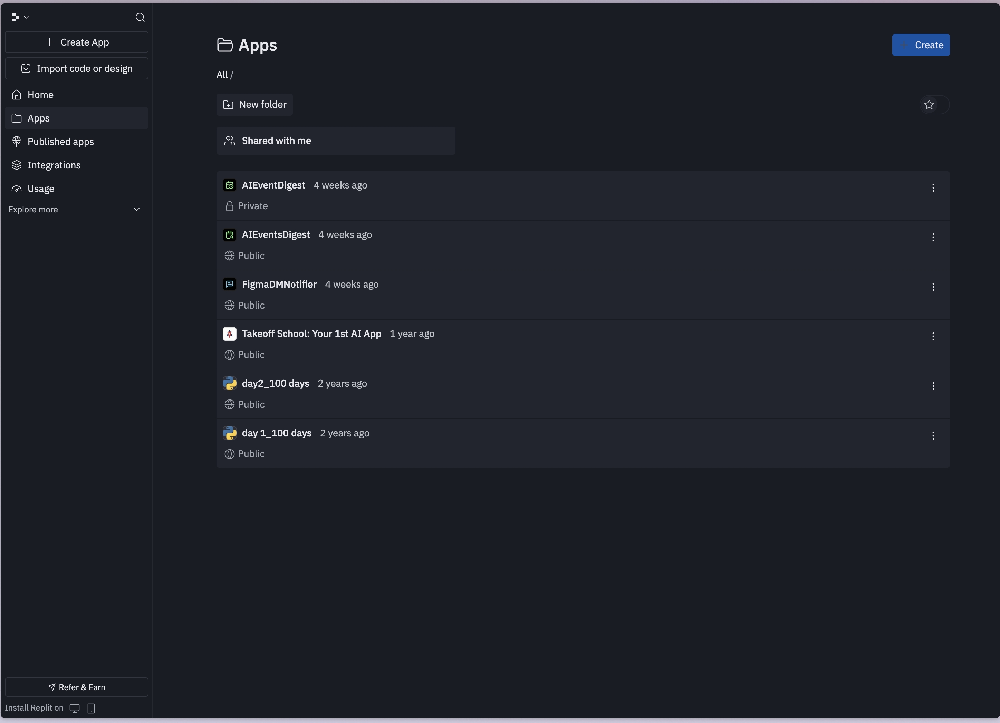

# Replit AI Agent - Apps List View

## Overview
Clean apps list interface with dark theme showing project management and organization. Features a collapsible sidebar with primary navigation and a main content area displaying all apps.

## Key Design Elements
- **Dark theme** with excellent contrast and readability
- **Sidebar navigation** with icon + label pattern
- **List layout** showing app names, privacy status, and timestamps
- **Action buttons** prominently placed ("Create App", "+ Create")
- **Status badges** (Private/Public indicators)
- **Contextual menus** (three-dot kebab menus)
- **Folder organization** options (New folder, Shared with me)

## Notable Features
- Consistent spacing and typography hierarchy
- Subtle hover states and interactions
- Time-based metadata ("4 weeks ago", "1 year ago")
- Icon system for app identification
- Clean separation between navigation and content

## Use Cases
- Project/app management dashboards
- File management systems
- Developer tool interfaces
- SaaS application list views
