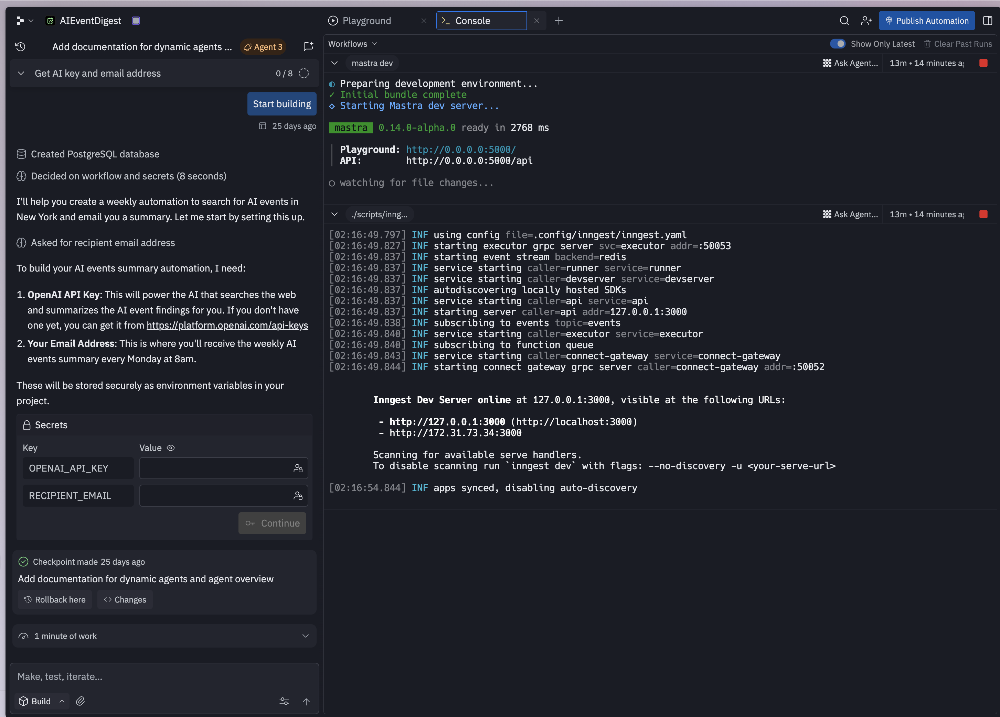

# Replit AI Agent - Development Console

## Overview
Multi-pane development environment showing a workflow builder on the left and a console/terminal output on the right. Demonstrates complex information architecture for developer tools.

## Key Design Elements
- **Three-column layout**: Sidebar, workflow panel, console output
- **Tabbed interface** - "Playground", "Console" tabs with close buttons
- **Terminal-style output** with color-coded log messages
- **Status indicators** showing build progress and timing
- **Agent assignment** badge ("Agent 3")
- **Workflow steps** displayed in left panel with expand/collapse
- **Color-coded messages** (INFO in green, service names in white)

## Notable Features
- Real-time console output with timestamps
- Syntax highlighting for URLs and technical content
- Clear visual separation between panes
- Workflow progress tracking (0/8 indicator)
- "Start building" prominent action button
- Secrets management UI with masked values
- Checkpoint system visible at bottom
- Time indicators (25 days ago)

## Technical Details
- Shows server startup logs
- Port information and URLs
- Service initialization status
- Development environment variables

## Use Cases
- Developer consoles
- Build/deployment interfaces
- Workflow execution monitors
- Terminal/shell interfaces
- Multi-pane development environments
