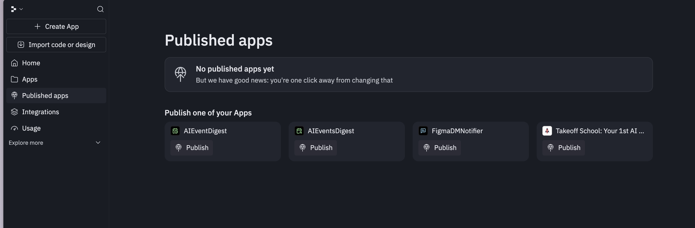

# Replit AI Agent - Published Apps Empty State

## Overview
Well-designed empty state screen for the "Published apps" section, featuring an encouraging message and clear call-to-action with available apps to publish displayed in a card grid.

## Key Design Elements
- **Empty state with friendly messaging** - "No published apps yet / But we have good news: you're one click away from changing that"
- **Icon illustration** for visual context (parachute/deployment icon)
- **Actionable CTA section** - "Publish one of your Apps"
- **Card grid layout** showing unpublished apps with publish buttons
- **Consistent dark theme** with subtle card backgrounds

## Notable Features
- Encouraging, human-friendly copy
- Clear path to action (publish buttons on each card)
- Visual hierarchy guiding users from empty state to action
- App cards with icons and "Publish" buttons
- Maintains consistency with overall interface design

## Use Cases
- Empty state designs
- Onboarding flows
- Publishing/deployment interfaces
- SaaS application dashboards
- User engagement and activation patterns
