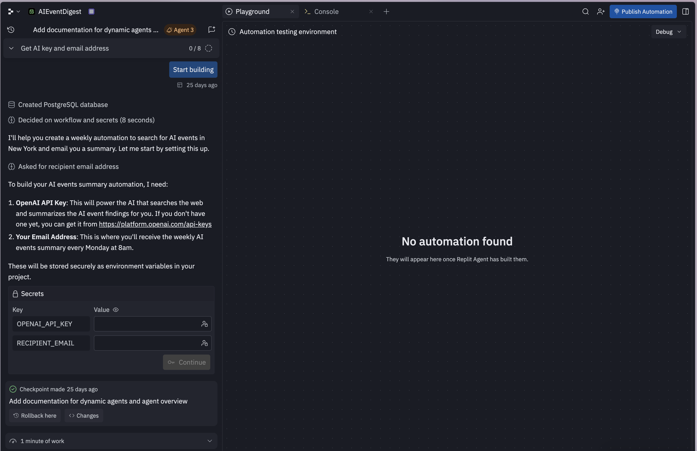

# Replit AI Agent - Workflow Builder & Chat Interface

## Overview
Sophisticated AI agent interface combining conversational workflow building with traditional form inputs. Shows a chat-based approach to creating automations with secrets management.

## Key Design Elements
- **Conversational interface** - AI explains what it needs and why
- **Workflow steps timeline** on the left showing progress
- **Tabbed workspace** - "Playground" and "Console" tabs
- **Secrets management** - Secure form inputs for API keys and credentials
- **Empty state on right** - "No automation found" with helpful message
- **Agent badge** showing "Agent 3" assignment
- **Status indicators** and checkpoints with timestamps
- **Masked input fields** for sensitive data
- **Action buttons** (Continue, Rollback, etc.)

## Notable Features
- Natural language explanations (AI describes setup process)
- Numbered requirements list (1. OpenAI API Key, 2. Your Email Address)
- Link to external resources (platform.openai.com/api-keys)
- Security-first design (environment variables, masked fields)
- Collapsible workflow steps
- Progress tracking (0/8 indicator)
- Checkpoint/rollback system
- Debug mode toggle
- "Publish Automation" CTA button

## Interaction Patterns
- Chat-style onboarding for complex setups
- Progressive disclosure of workflow steps
- Contextual help and explanations
- Secure credential handling
- Real-time status updates

## Use Cases
- AI agent builders
- Workflow automation tools
- Conversational form builders
- Developer onboarding experiences
- Secrets/credentials management
- Task automation platforms
- No-code/low-code builders
