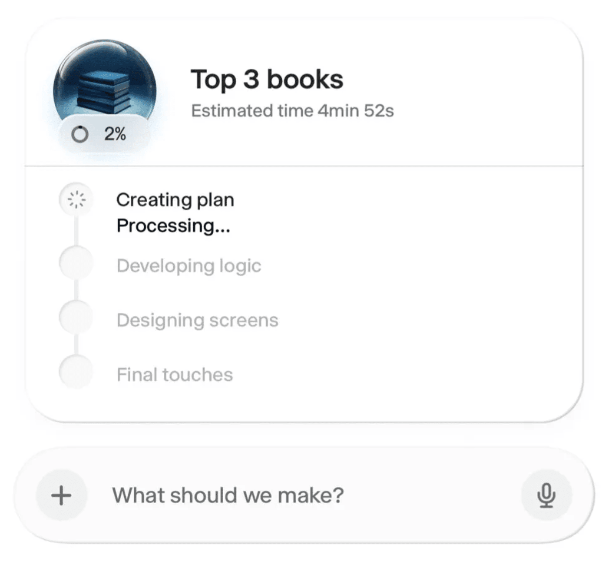

# AI Task Progress Card with Timeline

## Overview
Sophisticated progress card showing AI task execution with a vertical timeline, progress indicator, and status updates. Features glassmorphic styling and clear visual hierarchy.

## Key Design Elements
- **Header section**:
  - 3D book stack icon with circular progress (2%)
  - "Top 3 books" title
  - "Estimated time 4min 52s" subtitle
- **Vertical timeline** with four stages:
  - "Creating plan" (active with spinner)
  - "Developing logic" (inactive)
  - "Designing screens" (inactive)
  - "Final touches" (inactive)
- **Status indicators**:
  - Active state: spinner animation
  - Inactive states: empty circles
  - Connected by vertical line
- **Bottom action** - "What should we make?" input with mic icon
- **Card styling** - Soft rounded corners, subtle shadow, white background

## Notable Features
- Real-time progress visualization
- Clear task breakdown
- Active state highlighting
- Time estimation for user expectations
- Vertical connection lines between steps
- Glassmorphic icon treatment
- Clean typography hierarchy
- Microphone input for voice commands

## Interaction Patterns
- Loading/processing states clearly shown
- Sequential task flow visualization
- Progress percentage and time estimate
- Voice input option
- Visual feedback on current step

## Technical Details
- Percentage-based progress (2%)
- Time-based estimates (4min 52s)
- Multi-step process visualization
- Active/inactive state management

## Use Cases
- AI task processing interfaces
- Multi-step form progress
- Workflow visualization
- Loading states for complex operations
- Project management dashboards
- Onboarding flows
- Tutorial progress
- Build/compile progress
- Long-running task indicators
