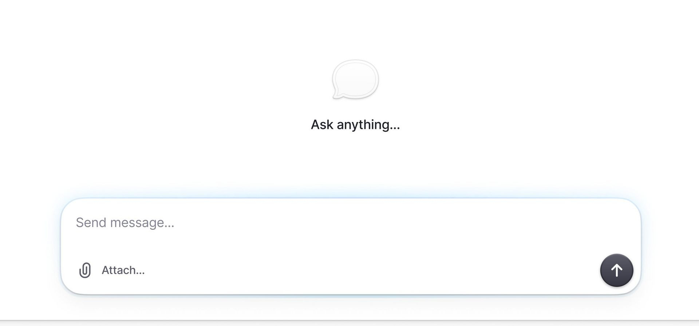

# Minimal AI Chat Interface

## Overview
Ultra-clean, minimalist chat interface design featuring an empty state prompt and a message composition area. Excellent example of modern AI chat UI with emphasis on simplicity and clarity.

## Key Design Elements
- **Empty state messaging** - "Ask anything..." with subtle chat bubble icon
- **Large input field** - "Send message..." placeholder with ample space
- **Action buttons**:
  - Paperclip icon with "Attach..." for file uploads
  - Circular send button with up arrow
- **Generous whitespace** - Breathing room creates calm, focused interface
- **Light color scheme** - Soft grays and whites
- **Subtle borders** - Light rounded borders on input field

## Notable Features
- Inviting empty state that encourages engagement
- Clear visual hierarchy
- Accessible button sizing
- Icon + text labels for clarity
- Rounded corners throughout for friendly feel
- Dark send button provides clear call-to-action

## Interaction Patterns
- Attachment functionality front and center
- Prominent send action
- Placeholder text guides user behavior
- Speech bubble icon reinforces chat context

## Use Cases
- AI chatbot interfaces
- Customer support chat
- Messaging applications
- Note-taking apps with AI features
- Search interfaces
- Command input fields
- Conversational UI designs
